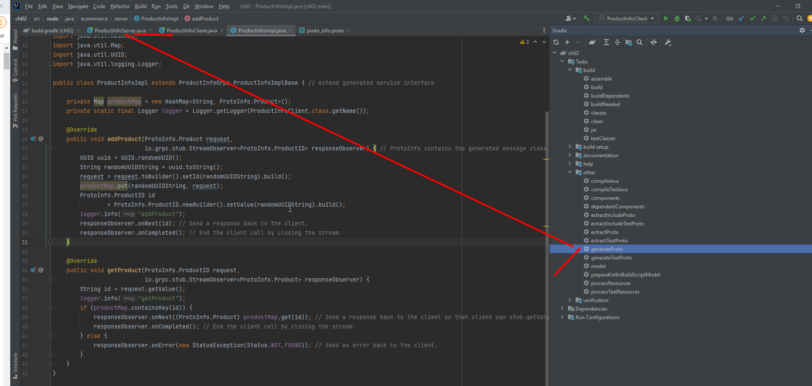

# learn-gRPC

## Study Material
- [gRPC: Up and Running](https://learning.oreilly.com/library/view/grpc-up-and/9781492058328)
    - [sample code](https://grpc-up-and-running.github.io/)
- ~~[Video](https://www.udemy.com/course/grpc-java/?couponCode=JAN_22_GET_STARTED)~~

## introduction
- gRPC primarily uses a synchronous request-response style for communication but can operate in fully asynchronous or streaming mode once the initial communication is established.

### interface definition language (IDL)
- used to generate service code
    - |||
      |---|---|
      |server skeleton (server-side code)|simplifies the server-side logic by providing low-level communication abstractions
      |client stub (client-side code)|simplifies the client-side communication with abstractions to hide low-level communication for different programming languages
- on client's side, invoke server's function is as easy as make a local function call
### how to wrte gRPC code
- [gradle configutation](./ch02/build.gradle)
1. write protocol buffers file
    - [proto_info.proto](ch02\src\main\proto\proto_info.proto)
2. protoc your protocol buffers file to generate gRPC server-side and client-side code
    - 
- how to develop a gRPC server
    1. Implement the service logic of the generated service skeleton by overriding the service base class.
        - [service implementation](ch02\src\main\java\ecommerce\server\ProductInfoImpl.java)
    2. Run a gRPC server to listen for requests from clients and return the service responses
        - [gRPC server](ch02\src\main\java\ecommerce\ProductInfoServer.java)
- how to develop a gRPC client ([example client](ch02\src\main\java\ecommerce\client\ProductInfoClient.java))
    1. Create a channel using remote server address
    2. Initialize blocking stub using the channel
    3. Call remote method using the blocking stub
#### how to config protocol buffer in gradle
https://dev.to//techschoolguru/config-gradle-to-generate-java-code-from-protobuf-1cla
### Evolution of Inter-Process Communication
||technology|detail|why outdated?|
|---|---|---|---|
|Conventional RPC|Common Object Request Broker Architecture (CORBA) and Java Remote Method Invocation (RMI)|built on top of TCP|too old
|Simple Object Access Protocol (SOAP)|service-oriented architecture (SOA) to exchange XML-based structured data between services|communicates using HTTP|complexity of message format
|Representational State Transfer (REST)|resource-oriented architecture (ROA), use url to distinguish the resource you want|- The state-changing operations are applied on top of those resources in the form of the HTTP verbs (GET, POST, PUT, DELETE, PATCH, and so on). - The resource state is represented in textual formats such as JSON, XML, HTML, YAML, and so on.|1. inefficient text-based protocol, JSON is human readable, but not efficient 2. lacks strong typed interface (just swagger docs, developers can choose not to obey)  3. extra effort to maintain ReSTful style

### gRPC advantage
1. efficient communication
2. simple, well-defined service interfaces and schema
    - define interface in proto buffer file
3. strongly typed
    - ensured in proto buffer file
4. polyglot
    - can be compiled in different languages after writing the profo buffer file
5. has duplex streaming
    - 4 API transmission type
6. built-in commodity features
    - support for commodity features such as authentication, encryption, resiliency (deadlines and timeouts), metadata exchange, compression, load balancing, service discovery, and so on
7. integrated with cloud native ecosystems
    - part of the CNCF
### gRPC disadvantage
1. not be suitable for external-facing services
    - stronged typed -> not flexible
    - can use gRPC gateway
2. service definition changes are a complicated development process
3. The ecosystem is relatively small
    - The support for gRPC in browser and mobile applications is still in the primitive stages.

## gRPC communication pattern
- sync v.s. async
    - if synchronous message passing scenarios, can use gRPC
    - if asynchronous message scenarios that may require persistent messaging, use MessageQueue
- internal v.s. external
    - if just internal usage, can use gRPC
    - if expose to external world, use ReSTful/SOAP/GraphQL

### Simple RPC (Unary RPC)
single request, single response (single response message)
- client直接stub.callMethod(), server直接返回value
### Server-streaming RPC
single request, sequence of responses (multiple response message)
- client直接stub.callMethod(), server直接返回StreamObserver<返回的类型> (通过streamObserver.OnNext(request)来返回多个response)
### Client-streaming RPC
sequence of request (multiple request message), single responses
- client直接通过StreamObserver<请求的类型>的onNext(request)来发送多个request, server直接返回value
### Bidirectional-streaming RPC
sequence of request (multiple request message), sequence of responses (multiple response message)
- 双方都有StreamObserver<...>
### 例子
- [proto](./ch02/src/main/proto/order_management.proto)
- [service implementation](ch02/src/main/java/ecommerce/server/OrderMgtServiceImpl.java)
- [client](ch02/src/main/java/ecommerce/client/OrderMgtClient.java)
- [gRPC server](ch02/src/main/java/ecommerce/OrderMgtServer.java)

## gRPC transmission in detail
