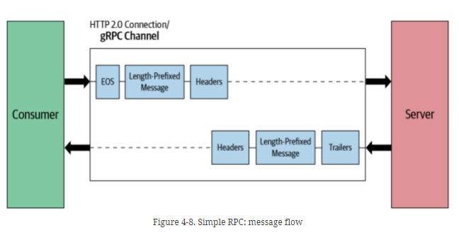
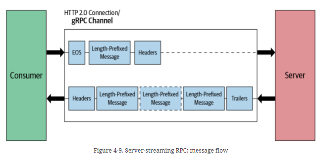
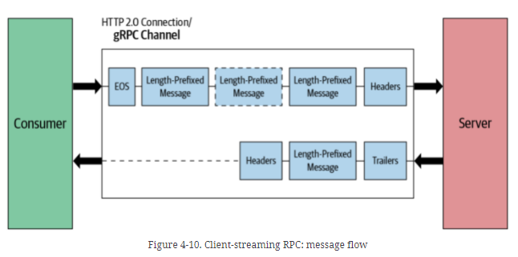
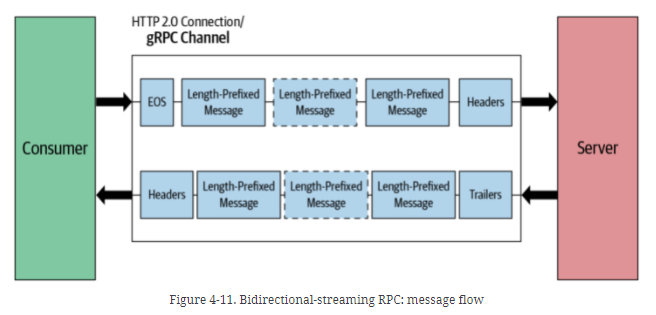
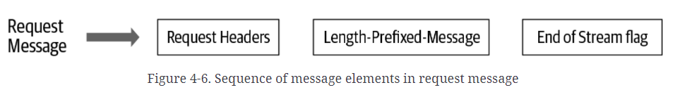
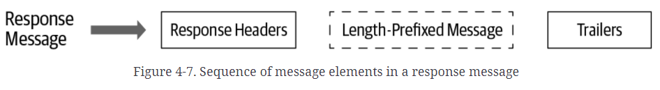

# learn-gRPC

## Study Material
- [gRPC: Up and Running](https://learning.oreilly.com/library/view/grpc-up-and/9781492058328)
    - [sample code](https://grpc-up-and-running.github.io/)
- ~~[Video](https://www.udemy.com/course/grpc-java/?couponCode=JAN_22_GET_STARTED)~~

## introduction
- gRPC primarily uses a synchronous request-response style for communication but can operate in fully asynchronous or streaming mode once the initial communication is established.

### interface definition language (IDL)
- used to generate service code
    - |||
      |---|---|
      |server skeleton (server-side code)|simplifies the server-side logic by providing low-level communication abstractions
      |client stub (client-side code)|simplifies the client-side communication with abstractions to hide low-level communication for different programming languages
- on client's side, invoke server's function is as easy as make a local function call
### how to wrte gRPC code
- [gradle configutation](./ch02/build.gradle)
1. write protocol buffers file
    - [proto_info.proto](ch02\src\main\proto\proto_info.proto)
2. protoc your protocol buffers file to generate gRPC server-side and client-side code
    - 
- how to develop a gRPC server
    1. Implement the service logic of the generated service skeleton by overriding the service base class.
        - [service implementation](ch02\src\main\java\ecommerce\server\ProductInfoImpl.java)
    2. Run a gRPC server to listen for requests from clients and return the service responses
        - [gRPC server](ch02\src\main\java\ecommerce\ProductInfoServer.java)
- how to develop a gRPC client ([example client](ch02\src\main\java\ecommerce\client\ProductInfoClient.java))
    1. Create a channel using remote server address
    2. Initialize blocking stub using the channel
    3. Call remote method using the blocking stub
#### how to config protocol buffer in gradle
https://dev.to//techschoolguru/config-gradle-to-generate-java-code-from-protobuf-1cla
### Evolution of Inter-Process Communication
||technology|detail|why outdated?|
|---|---|---|---|
|Conventional RPC|Common Object Request Broker Architecture (CORBA) and<br/>Java Remote Method Invocation (RMI)|built on top of TCP|too old
|Simple Object Access Protocol (SOAP)|service-oriented architecture (SOA) to exchange XML-based structured data between services|communicates using HTTP|complexity of message format
|Representational State Transfer (REST)|resource-oriented architecture (ROA), use url to distinguish the resource you want|- The state-changing operations are applied on top of those resources in the form of the HTTP verbs (GET, POST, PUT, DELETE, PATCH, and so on).<br/>- The resource state is represented in textual formats such as JSON, XML, HTML, YAML, and so on.|1. inefficient text-based protocol, JSON is human readable, but not efficient<br/>2. lacks strong typed interface (just swagger docs, developers can choose not to obey)<br/> 3. extra effort to maintain ReSTful style

### gRPC advantage
1. efficient communication
2. simple, well-defined service interfaces and schema
    - define interface in proto buffer file
3. strongly typed
    - ensured in proto buffer file
4. polyglot
    - can be compiled in different languages after writing the profo buffer file
5. has duplex streaming
    - 4 API transmission type
6. built-in commodity features
    - support for commodity features such as authentication, encryption, resiliency (deadlines and timeouts), metadata exchange, compression, load balancing, service discovery, and so on
7. integrated with cloud native ecosystems
    - part of the CNCF
### gRPC disadvantage
1. not be suitable for external-facing services
    - stronged typed -> not flexible
    - can use gRPC gateway
2. service definition changes are a complicated development process
3. The ecosystem is relatively small
    - The support for gRPC in browser and mobile applications is still in the primitive stages.


## gRPC communication pattern + message flow
- sync v.s. async
    - if synchronous message passing scenarios, can use gRPC
    - if asynchronous message scenarios that may require persistent messaging, use MessageQueue
- internal v.s. external
    - if just internal usage, can use gRPC
    - if expose to external world, use ReSTful/SOAP/GraphQL

### Simple RPC (Unary RPC)
single request, single response (single response message)
- client直接stub.callMethod(), server直接返回value
- 
### Server-streaming RPC
single request, sequence of responses (multiple response message)
- client直接stub.callMethod(), server直接返回StreamObserver<返回的类型> (通过streamObserver.OnNext(request)来返回多个response)
- 
### Client-streaming RPC
sequence of request (multiple request message), single responses
- client直接通过StreamObserver<请求的类型>的onNext(request)来发送多个request, server直接返回value
- 
### Bidirectional-streaming RPC
sequence of request (multiple request message), sequence of responses (multiple response message)
- 双方都有StreamObserver<...>
- 
### 例子
- [proto](./ch02/src/main/proto/order_management.proto)
- [service implementation](ch02/src/main/java/ecommerce/server/OrderMgtServiceImpl.java)
- [client](ch02/src/main/java/ecommerce/client/OrderMgtClient.java)
- [gRPC server](ch02/src/main/java/ecommerce/OrderMgtServer.java)


## gRPC communication flow in detail
### gRPC transmission
- 
    
    1. The client process calls the `getProduct` function in the generated stub.
    2. The client stub creates an <u>HTTP POST</u> request with the encoded message _(using **Protocol buffer** to encode)_. **In gRPC, all requests are HTTP POST requests with content-type prefixed with application/grpc.** The remote function (/ProductInfo/getProduct) that it invokes is sent as a separate HTTP header.
    3. The HTTP request message is sent across the network to the server machine.
    4. When the message is received at the server, the server examines the message headers to see which service function needs to be called and hands over the message to the service stub.
    5. The service stub decodes message bytes into language-specific data structures.
    6. Then, using the decoded message, the service makes a local call to the getProduct function.
    7. The response from the service function is encoded and sent back to the client. The response message follows the same procedure that we observed on the client side (response→encode→HTTP response on the wire); the message is unpacked and its value returned to the waiting client process.

### gRPC over HTTP/2.0
HTTP/2.0 builds a stream (long connection) between the client and server. frame (basic unit of data transmitted through HTTP/2.0) can be 1+(gRPC message splitted due to its size) gRPC length-prefixed message. 

### request message
[message structure in detail](https://github.com/grpc/grpc/blob/master/doc/PROTOCOL-HTTP2.md)

- 
- header
    ```
    HEADERS (flags = END_HEADERS)
    :method = POST // Defines the HTTP method. For gRPC, this is always POST.
    
    :scheme = http // Defines the HTTP scheme. If TLS (Transport Level Security) is enabled, the scheme is set to “https,” otherwise it is “http.”
    
    :path = /ProductInfo/getProduct // Defines the endpoint path. For gRPC, this value is constructed as “/” {service name} “/” {method name}.
    
    :authority = abc.com // Defines the virtual hostname of the target URI.

    te = trailers // Defines detection of incompatible proxies. For gRPC, the value must be “trailers.”

    grpc-timeout = 1S // Defines call timeout. If not specified, the server should assume an infinite timeout.

    content-type = application/grpc // For gRPC, the content-type should begin with application/grpc. If not, gRPC servers will respond with an HTTP status of 415 (Unsupported Media Type).
    
    grpc-encoding = gzip // Defines the message compression type. Possible values are identity, gzip, deflate, snappy, and {custom}.
    
    authorization = Bearer xxxxxx // This is optional metadata. authorization metadata is used to access the secure endpoint.
    ```
- length-prefixed message (+ EOS: end of stream flag message)
    ```
    DATA (flags = END_STREAM) // END_STREAM flag on the last DATA frame with empty Length-Prefixed Message to indicate the last message

    <Length-Prefixed Message>
    ```

### response message
[message structure in detail](https://github.com/grpc/grpc/blob/master/doc/PROTOCOL-HTTP2.md)

- 
- header
    ```
    HEADERS (flags = END_HEADERS)
    :status = 200 // Indicates the status of the HTTP request.
    
    grpc-encoding = gzip // Defines the message compression type. Possible values include identity, gzip, deflate, snappy, and {custom}.
    
    content-type = application/grpc // For gRPC, the content-type should begin with application/grpc.
    ```
- length-prefixed message
    ```
    DATA // this time end message is defined as trailer, no need of END_STREAM flag

    <Length-Prefixed Message>
    ```
- trailer
    ```
    HEADERS (flags = END_STREAM, END_HEADERS)
    grpc-status = 0 # OK // Defines the gRPC status code.
    grpc-message = xxxxxx // Defines the description of the error. This is optional. This is only set when there is an error in processing the request.
    ```


